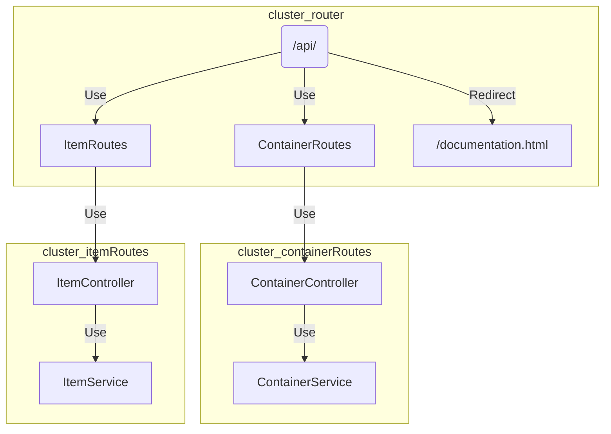

# Backend Routing Documentation

## Overview

The backend routing system is designed using Express.js to handle requests related to containers and items. The routing is organized into three main components: `router.js`, `containerRoutes.js`, and `itemRoutes.js`. These routes connect to controllers, which in turn interact with two types of services: `ContainerService` and `ItemService`. The services interact with the MongoDB database to perform CRUD operations.

## Routing Architecture

### router.js

The main entry point for the backend routing. It connects to the Container and Item routes and redirects to the documentation.

- `/api/containers` : Routes related to containers
- `/api/items` : Routes related to items
- `/api/docs` : Redirects to documentation

### Router Connection Diagram

---
### containerRoutes.js

Handles container-related routes, connecting to the `ContainerController` and `ContainerService`.

- `/` : POST - Create a container
- `/` : GET - Get all containers
- `/:id` : GET - Get container by ID
- `/:id` : PUT - Update container by ID
- `/:id` : DELETE - Delete container by ID
- `/moveItem` : POST - Move item to container
- `/search/:id` : GET - Get container by item ID

### itemRoutes.js

Handles item-related routes, connecting to the `ItemController` and `ItemService`.

markdown

- `/` : GET - Get all items
- `/` : POST - Create an item
- `/:id` : GET - Get items by container ID
- `/item/:id` : GET - Get item by ID
- `/item/:id` : PUT - Update item by ID
- `/item/:id` : DELETE - Delete item by ID