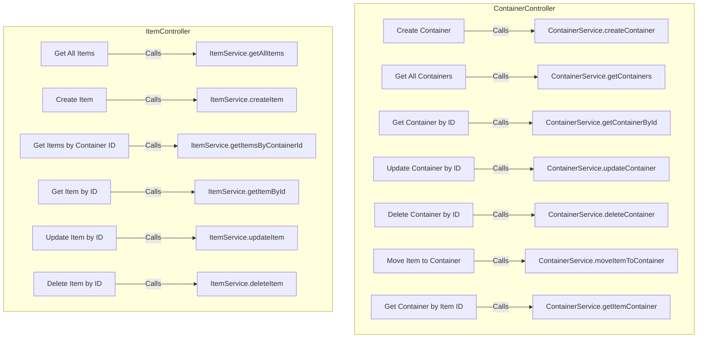
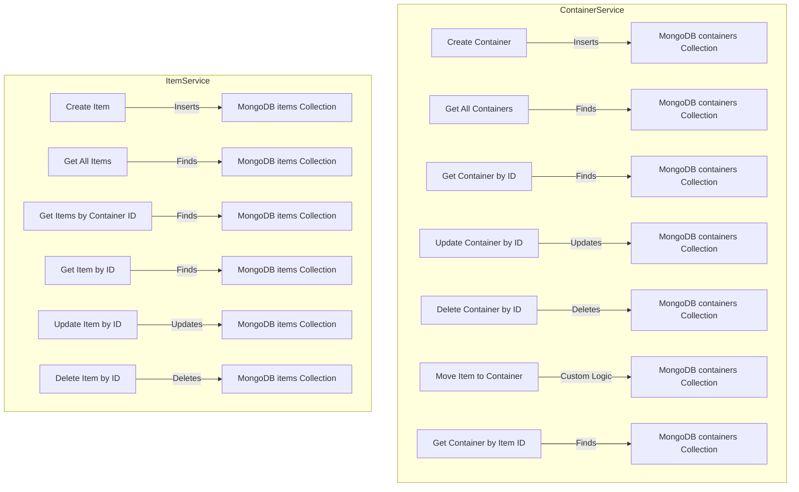

## Controller-Service Connection

### ContainerController

Connects to the `ContainerService` to handle container-related logic.

### ItemController

Connects to the `ItemService` to handle item-related logic.

## Service-Database Connection

### ContainerService

Handles CRUD operations related to containers in the MongoDB database.

### ItemService

Handles CRUD operations related to items in the MongoDB database.

### Controller-Service Connection Diagram

### Service-Database Connection Diagram

