# Home Inventory App Code Documentation

In this document, we provide code documentation for a Vue 3 application that manages a home inventory system. The application is built using Vue 3 and the Pinia state management library. Below, we break down the code, explain its functionality, and provide visual diagrams using PlantUML and Mermaid where appropriate.

## Table of Contents

1. [Project Structure](#project-structure)
2. [Vue Component](#vue-component)
3. [Pinia Store](#pinia-store)
4. [API Integration](#api-integration)
5. [Functionality Overview](#functionality-overview)

## Project Structure

### src/components/HomeInventory.vue

This is the main Vue component that serves as the user interface of the home inventory application.

### src/store/index.js

This is the Pinia store that manages the state of the application, including containers and displayed items.

## Vue Component

### Vue Component Overview

The Vue component `HomeInventory.vue` represents the main interface of the home inventory application. It includes two main sections: the sidebar for managing containers and the main content area for displaying items within the selected container.

### PlantUML Diagrams

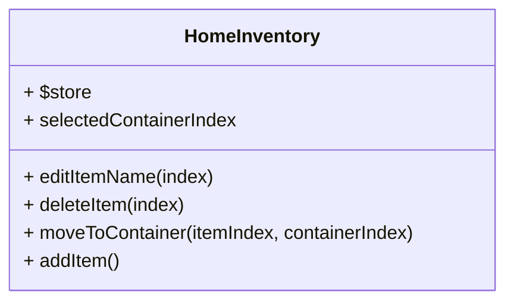

 **Component Structure Diagram:**

   ```mermaid
   graph LR
     subgraph HomeInventoryComponent
       a[Sidebar]
       b[Main Content Area]
     end
     c((User))
     a -->|Manage Containers| c
     b -->|Display Items| c
   ```

 **State Management Diagram:**

   ```mermaid
   classDiagram
   class useInventoryStore {
     + containers
     + displayeditems
     + containersExcludedSecected
     + allItems
     + selectedContainer
     + fetchAllItems()
     + fetchContainers()
     + addContainer(name)
     + updateContainerName(index, newName)
     + selectContainer(index)
     + addItem(name)
     + moveItem(itemIndex, containerIndex)
     + deleteItem(index)
     + selectContainerById(containerId)
     + fetchContainersExeptSelected()
     + deleteContainer(index)
     + updateItemName(index, newName, newqtty, newexpiration_date)
   }
   ```

 **API Integration Diagram:**

   ```mermaid
   graph TD
     A[User] -->|CRUD Operations| B[API]
     B -->|Database| D[Database]
     B -->|Containers| E[Containers]
     B -->|Items| F[Items]
   ```

 **Container Management Diagram:**

   ```mermaid
   graph LR
     A[User] -->|Manage Containers| B[Home Inventory]
     B -->|Add Container| C[Pinia Store]
     B -->|Edit Container| C
     B -->|Delete Container| C
   ```
 **Item Management Diagram:**

   ```mermaid
   graph LR
     A[User] -->|Manage Items| B[Home Inventory]
     B -->|Add Item| C[Pinia Store]
     B -->|Edit Item| C
     B -->|Delete Item| C
     B -->|Move Item| C
   ```

 **Data Flow Diagram:**

   ```mermaid
   graph TD
     A[User] -->|Interacts with| B[Home Inventory Component]
     B -->|Utilizes| C[Pinia Store]
     C -->|Communicates with| D[API]
   ```
   **Container CRUD Sequence Diagram:**

   This sequence diagram illustrates the interaction between a user and the Home Inventory application when performing CRUD operations on containers.

   ```mermaid
   sequenceDiagram
     participant User
     participant Home Inventory
     participant Pinia Store
     participant API
     User->>Home Inventory: Manage Containers
     Home Inventory->>Pinia Store: Request to Fetch Containers
     Pinia Store->>API: Fetch Containers
     API->>Pinia Store: Containers Data
     Pinia Store-->>Home Inventory: Updated Containers
     Home Inventory-->>User: Display Containers
     User->>Home Inventory: Add Container
     Home Inventory->>Pinia Store: Request to Add Container
     Pinia Store->>API: Create Container
     API->>Pinia Store: New Container Data
     Pinia Store-->>Home Inventory: Updated Containers
     User->>Home Inventory: Edit Container
     Home Inventory->>Pinia Store: Request to Edit Container
     Pinia Store->>API: Update Container
     API->>Pinia Store: Updated Container Data
     Pinia Store-->>Home Inventory: Updated Containers
     User->>Home Inventory: Delete Container
     Home Inventory->>Pinia Store: Request to Delete Container
     Pinia Store->>API: Delete Container
     API->>Pinia Store: Confirmation
     Pinia Store-->>Home Inventory: Updated Containers
   ```

 **Item CRUD Sequence Diagram:**

   This sequence diagram illustrates the interaction between a user and the Home Inventory application when performing CRUD operations on items.

   ```mermaid
   sequenceDiagram
     participant User
     participant Home Inventory
     participant Pinia Store
     participant API
     User->>Home Inventory: Manage Items
     Home Inventory->>Pinia Store: Request to Fetch Items
     Pinia Store->>API: Fetch Items
     API->>Pinia Store: Items Data
     Pinia Store-->>Home Inventory: Updated Items
     Home Inventory-->>User: Display Items
     User->>Home Inventory: Add Item
     Home Inventory->>Pinia Store: Request to Add Item
     Pinia Store->>API: Create Item
     API->>Pinia Store: New Item Data
     Pinia Store-->>Home Inventory: Updated Items
     User->>Home Inventory: Edit Item
     Home Inventory->>Pinia Store: Request to Edit Item
     Pinia Store->>API: Update Item
     API->>Pinia Store: Updated Item Data
     Pinia Store-->>Home Inventory: Updated Items
     User->>Home Inventory: Delete Item
     Home Inventory->>Pinia Store: Request to Delete Item
     Pinia Store->>API: Delete Item
     API->>Pinia Store: Confirmation
     Pinia Store-->>Home Inventory: Updated Items
   ```


 **Data Synchronization Sequence Diagram:**

    This sequence diagram illustrates how the application synchronizes data with the API to maintain consistency.

    ```mermaid
    sequenceDiagram
      participant API
      participant Pinia Store
      participant Home Inventory
      API->>Pinia Store: Send Data Changes (e.g., Container Update)
      Pinia Store->>API: Update Data (e.g., Container Update Confirmation)
      API->>Pinia Store: Send Data Changes (e.g., Item Update)
      Pinia Store->>API: Update Data (e.g., Item Update Confirmation)
      Home Inventory->>Pinia Store: Request Data (e.g., Fetch Containers)
      Pinia Store->>API: Retrieve Data (e.g., Fetch Containers Data)
      API-->>Pinia Store: Data Response
      Pinia Store-->>Home Inventory: Updated Data
    ```

### Component Structure

1. The component includes a sidebar on the left that displays a list of containers and provides options to edit and delete containers.
2. It has a main content area on the right that displays items within the selected container and provides options to edit, delete, and move items.
3. Users can add new containers and new items using the respective buttons.

## Pinia Store

### Pinia Store Overview

The Pinia store, defined in `src/store/index.js`, manages the application's state. It includes state properties for containers, displayed items, and the selected container. It also defines actions to interact with the API and manipulate the state.

### PlantUML Diagram

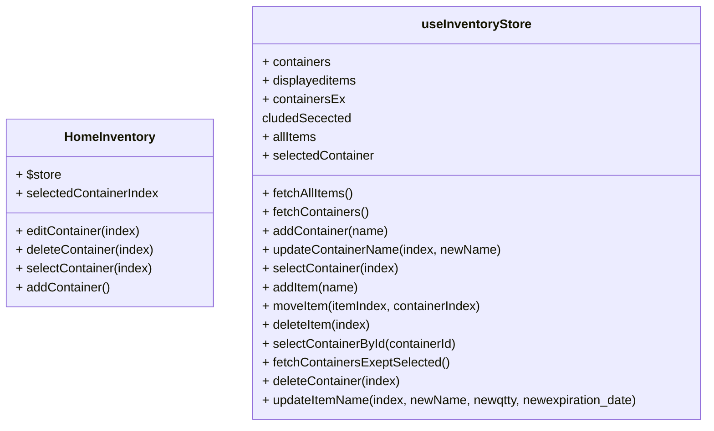

### Store Methods

1. `fetchAllItems`: Fetches all items from the API.
2. `fetchContainers`: Fetches all containers from the API.
3. `addContainer(name)`: Adds a new container to the store and the API.
4. `updateContainerName(index, newName)`: Updates the name of a container.
5. `selectContainer(index)`: Selects a container and fetches its items.
6. `addItem(name)`: Adds a new item to the selected container.
7. `moveItem(itemIndex, containerIndex)`: Moves an item to another container.
8. `deleteItem(index)`: Deletes an item from the selected container.
9. `selectContainerById(containerId)`: Selects a container by its ID.
10. `fetchContainersExeptSelected()`: Fetches containers excluding the currently selected one.
11. `deleteContainer(index)`: Deletes a container from the store and the API.
12. `updateItemName(index, newName, newqtty, newexpiration_date)`: Updates the name of an item.

Certainly! Below are Mermaid diagrams illustrating each method of the `useInventoryStore` store:

### `fetchAllItems` Method Diagram:

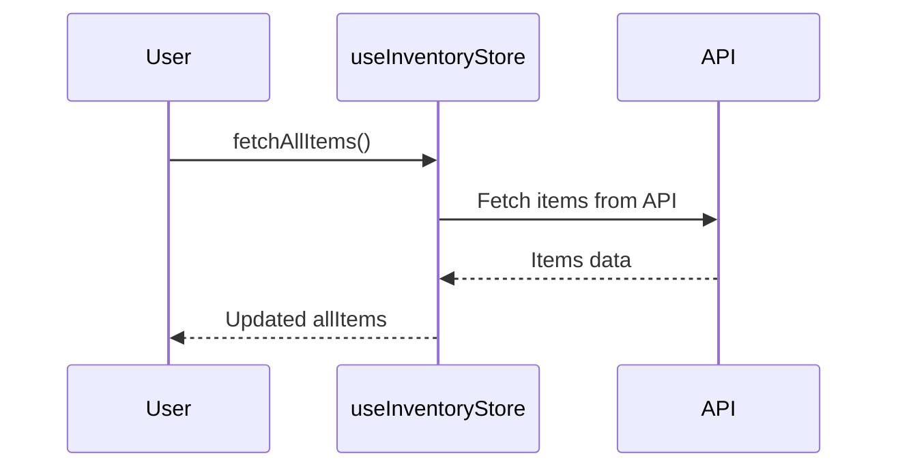

### `fetchContainers` Method Diagram:

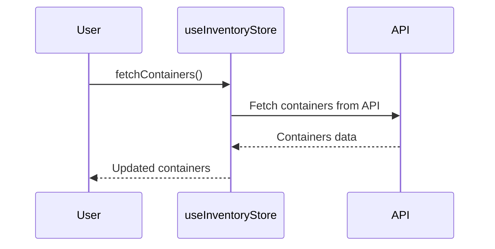

### `addContainer` Method Diagram:

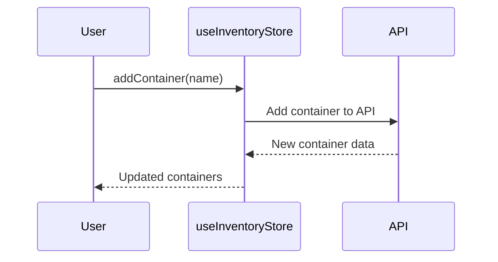

### `updateContainerName` Method Diagram:

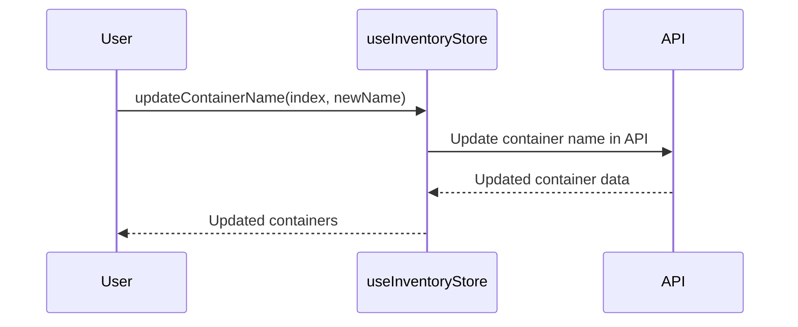

### `selectContainer` Method Diagram:

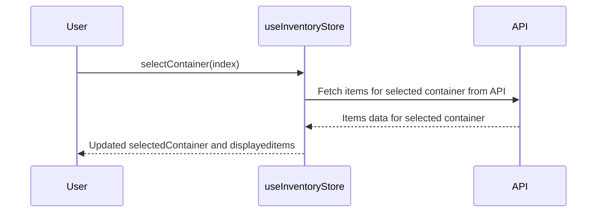

### `addItem` Method Diagram:

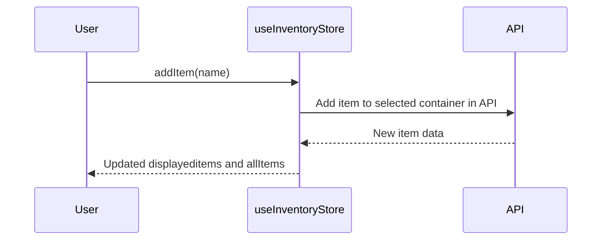

### `moveItem` Method Diagram:

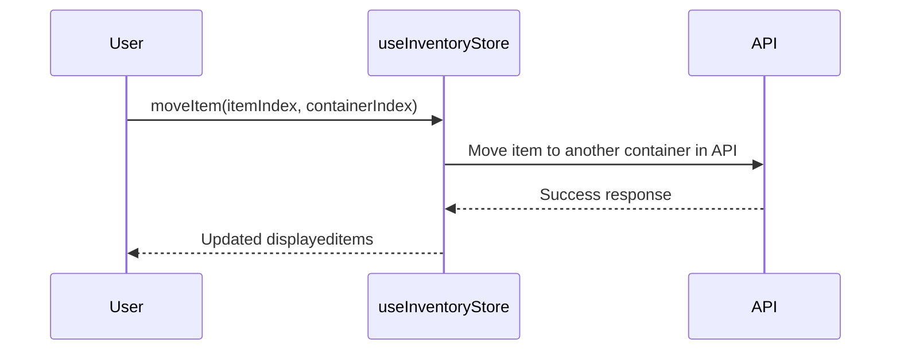

### `deleteItem` Method Diagram:

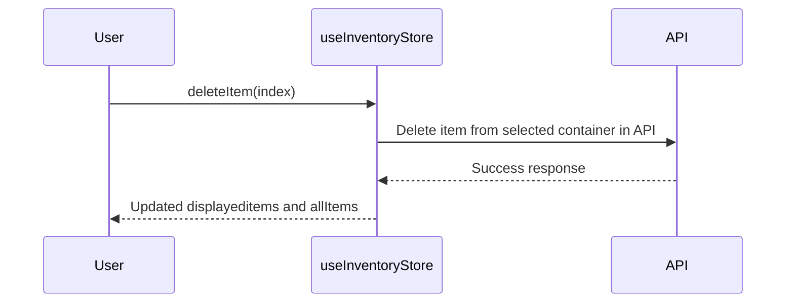

### `selectContainerById` Method Diagram:

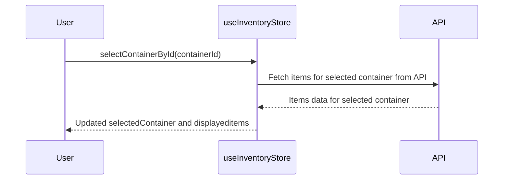

### `fetchContainersExeptSelected` Method Diagram:

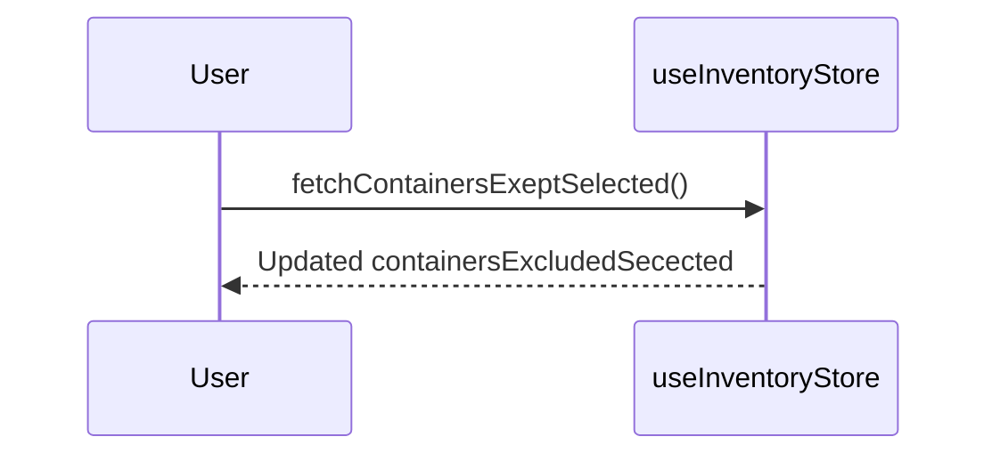

### `deleteContainer` Method Diagram:

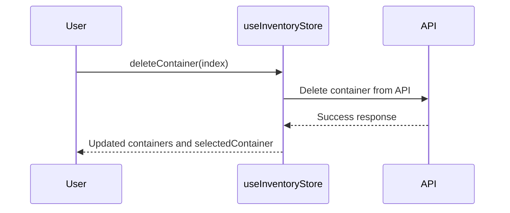

### `updateItemName` Method Diagram:

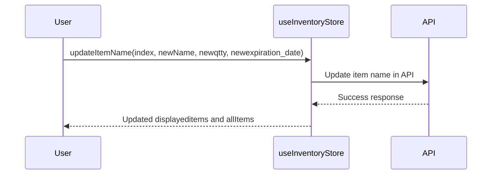


## API Integration

### API Overview

The application interacts with a backend API to perform CRUD operations on containers and items. The API is responsible for managing the database and responding to requests from the front end.

### API Endpoints


### API Endpoints

- `GET /containers`: Fetches the list of containers.
- `POST /containers`: Adds a new container.
- `PUT /containers/{containerId}`: Updates the name of a container.
- `GET /items/{containerId}`: Fetches items within a container.
- `POST /items`: Adds a new item to a container.
- `DELETE /items/item/{itemId}`: Deletes an item.
- `DELETE /containers/{containerId}`: Deletes a container.

## Functionality Overview

### Application Functionality

1. Users can manage containers, including adding, editing, and deleting them.
2. Users can select a container and view, add, edit, move, and delete items within that container.
3. The application enforces limits on the number of containers and items.

### Application Limitations

1. Container limit: 15 containers.
2. Item limit per container: 20 items.

## Conclusion

This documentation provides an overview of the structure and functionality of the home inventory application. Developers can refer to this documentation to understand how different components interact and how to use the Pinia store for state management.
