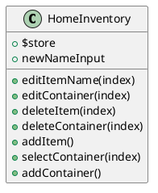
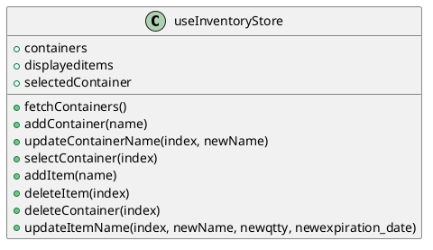

# Home Inventory App Code Documentation

In this document, we will provide code documentation for a Vue 3 application that manages a home inventory system. The application is built using Vue 3 and the Pinia state management library. Below, we will break down the code, explain its functionality, and provide visual diagrams using PlantUML and Mermaid where appropriate.

## Table of Contents

1. [Project Structure](#project-structure)
2. [Vue Component](#vue-component)
3. [Pinia Store](#pinia-store)
4. [API Integration](#api-integration)
5. [Functionality Overview](#functionality-overview)

## Project Structure

### src/components/HomeInventory.vue

This is the main Vue component that serves as the user interface of the home inventory application.

### src/store/index.js

This is the Pinia store that manages the state of the application, including containers and displayed items.

## Vue Component

### Vue Component Overview

The Vue component `HomeInventory.vue` represents the main interface of the home inventory application. It includes two main sections: the sidebar for managing containers and the main content area for displaying items within the selected container.

### PlantUML Diagram

### Component Structure

1. The component includes a sidebar on the left that displays a list of containers and provides options to edit and delete containers.
2. It has a main content area on the right that displays items within the selected container and provides options to edit and delete items.
3. Users can add new containers and new items using the respective buttons.

## Pinia Store

### Pinia Store Overview

The Pinia store, defined in `src/store/index.js`, manages the application's state. It includes state properties for containers, displayed items, and the selected container. It also defines actions to interact with the API and manipulate the state.

### PlantUML Diagram

### Store Structure

1. **State Properties:**
   - `containers`: An array of container objects.
   - `displayeditems`: An array of displayed items in the selected container.
   - `selectedContainer`: The currently selected container.

2. **Actions:**
   - `fetchContainers()`: Fetches containers from the API and updates the `containers` state.
   - `addContainer(name)`: Adds a new container to the API and updates the `containers` state.
   - `updateContainerName(index, newName)`: Updates the name of a container in the API and updates the `containers` state.
   - `selectContainer(index)`: Selects a container and fetches its items from the API, updating the `selectedContainer` and `displayeditems` state.
   - `addItem(name)`: Adds a new item to the selected container in the API and updates the `displayeditems` state.
   - `deleteItem(index)`: Deletes an item from the selected container in the API and updates the `displayeditems` state.
   - `deleteContainer(index)`: Deletes a container from the API and updates the `containers` and `selectedContainer` states.
   - `updateItemName(index, newName, newqtty, newexpiration_date)`: Updates the name, quantity, and expiration date of an item in the API and updates the `displayeditems` state.

## API Integration

The application interacts with an API to perform CRUD operations on containers and items. The API endpoints are constructed based on the actions defined in the Pinia store.

### API Endpoints

- `GET /containers`: Fetches the list of containers.
- `POST /containers`: Adds a new container.
- `PUT /containers/{containerId}`: Updates the name of a container.
- `GET /items/{containerId}`: Fetches items within a container.
- `POST /items`: Adds a new item to a container.
- `DELETE /items/item/{itemId}`: Deletes an item.
- `DELETE /containers/{containerId}`: Deletes a container.

## Functionality Overview

The application provides the following functionality:

- Listing and managing containers, including editing and deleting containers.
- Selecting a container to view and manage the items it contains.
- Listing and managing items within the selected container, including editing and deleting items.
- Adding new containers and new items.

The application fetches and updates data from the API to keep the state synchronized with the server. Users can interact with the UI to perform various operations on containers and items.

By using Vue 3 and the Pinia store, the application offers a responsive and efficient user experience for managing a home inventory.