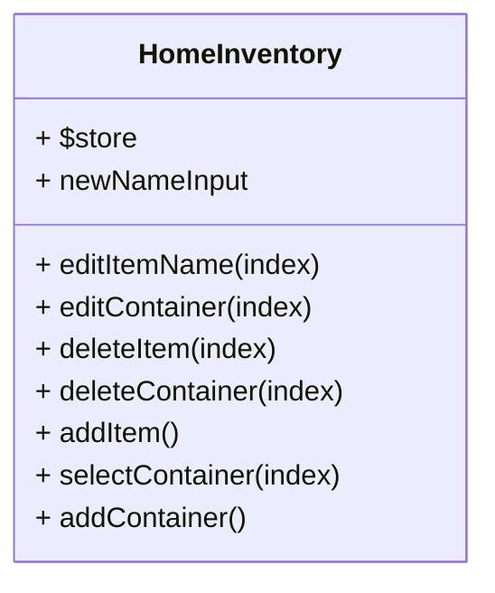
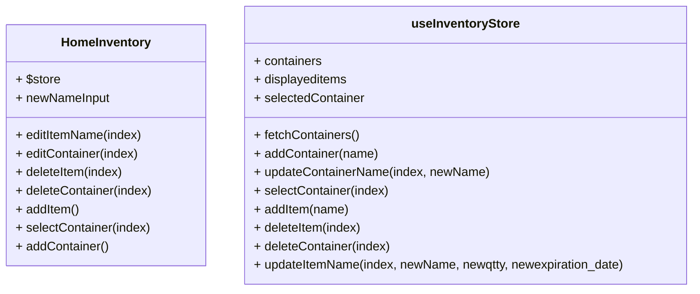

# Home Inventory App Code Documentation

In this document, we will provide code documentation for a Vue 3 application that manages a home inventory system. The application is built using Vue 3 and the Pinia state management library. Below, we will break down the code, explain its functionality, and provide visual diagrams using PlantUML and Mermaid where appropriate.

## Table of Contents

1. [Project Structure](#project-structure)
2. [Vue Component](#vue-component)
3. [Pinia Store](#pinia-store)
4. [API Integration](#api-integration)
5. [Functionality Overview](#functionality-overview)

## Project Structure

### src/components/HomeInventory.vue

This is the main Vue component that serves as the user interface of the home inventory application.

### src/store/index.js

This is the Pinia store that manages the state of the application, including containers and displayed items.

## Vue Component

### Vue Component Overview

The Vue component `HomeInventory.vue` represents the main interface of the home inventory application. It includes two main sections: the sidebar for managing containers and the main content area for displaying items within the selected container.

### PlantUML Diagram



1. **Component Structure Diagram:**

   This diagram illustrates the structure of the Vue component `HomeInventory.vue` and its key elements.

   ```mermaid
   graph LR
     subgraph HomeInventoryComponent
       a[Sidebar]
       b[Main Content Area]
     end
     c((User))
     a -->|Manage Containers| c
     b -->|Display Items| c
   ```

2. **State Management Diagram:**

   This diagram shows how the Pinia store manages the application's state, including containers and displayed items.

   ```mermaid
   classDiagram
   class useInventoryStore {
     + containers
     + displayeditems
     + selectedContainer
     + fetchContainers()
     + addContainer(name)
     + updateContainerName(index, newName)
     + selectContainer(index)
     + addItem(name)
     + deleteItem(index)
     + deleteContainer(index)
     + updateItemName(index, newName, newqtty, newexpiration_date)
   }
   ```

3. **API Integration Diagram:**

   Illustrates how the application communicates with the API by sending HTTP requests to perform CRUD operations.

   ```mermaid
   graph TD
     A[User] -->|CRUD Operations| B[API]
     B -->|Database| D[Database]
     B -->|Containers| E[Containers]
     B -->|Items| F[Items]
   ```

4. **Container Management Diagram:**

   Shows the actions and state changes involved in container management.

   ```mermaid
   graph LR
     A[User] -->|Manage Containers| B[Home Inventory]
     B -->|Add Container| C[Pinia Store]
     B -->|Edit Container| C
     B -->|Delete Container| C
   ```

5. **Item Management Diagram:**

   Illustrates the actions and state changes associated with item management within a selected container.

   ```mermaid
   graph LR
     A[User] -->|Manage Items| B[Home Inventory]
     B -->|Add Item| C[Pinia Store]
     B -->|Edit Item| C
     B -->|Delete Item| C
   ```

6. **Data Flow Diagram:**

   Represents the flow of data between the components, the Pinia store, and the API.

   ```mermaid
   graph TD
     A[User] -->|Interacts with| B[Home Inventory Component]
     B -->|Utilizes| C[Pinia Store]
     C -->|Communicates with| D[API]
   ```

These diagrams provide a comprehensive visual overview of the Home Inventory application, its components, state management, API integration, and data flow.

7. **Container CRUD Sequence Diagram:**

   This sequence diagram illustrates the interaction between a user and the Home Inventory application when performing CRUD operations on containers.

   ```mermaid
   sequenceDiagram
     participant User
     participant Home Inventory
     participant Pinia Store
     participant API

     User->>Home Inventory: Manage Containers
     Home Inventory->>Pinia Store: Request to Fetch Containers
     Pinia Store->>API: Fetch Containers
     API->>Pinia Store: Containers Data
     Pinia Store-->>Home Inventory: Updated Containers
     Home Inventory-->>User: Display Containers

     User->>Home Inventory: Add Container
     Home Inventory->>Pinia Store: Request to Add Container
     Pinia Store->>API: Create Container
     API->>Pinia Store: New Container Data
     Pinia Store-->>Home Inventory: Updated Containers

     User->>Home Inventory: Edit Container
     Home Inventory->>Pinia Store: Request to Edit Container
     Pinia Store->>API: Update Container
     API->>Pinia Store: Updated Container Data
     Pinia Store-->>Home Inventory: Updated Containers

     User->>Home Inventory: Delete Container
     Home Inventory->>Pinia Store: Request to Delete Container
     Pinia Store->>API: Delete Container
     API->>Pinia Store: Confirmation
     Pinia Store-->>Home Inventory: Updated Containers
   ```

8. **Item CRUD Sequence Diagram:**

   This sequence diagram illustrates the interaction between a user and the Home Inventory application when performing CRUD operations on items.

   ```mermaid
   sequenceDiagram
     participant User
     participant Home Inventory
     participant Pinia Store
     participant API

     User->>Home Inventory: Manage Items
     Home Inventory->>Pinia Store: Request to Fetch Items
     Pinia Store->>API: Fetch Items
     API->>Pinia Store: Items Data
     Pinia Store-->>Home Inventory: Updated Items
     Home Inventory-->>User: Display Items

     User->>Home Inventory: Add Item
     Home Inventory->>Pinia Store: Request to Add Item
     Pinia Store->>API: Create Item
     API->>Pinia Store: New Item Data
     Pinia Store-->>Home Inventory: Updated Items

     User->>Home Inventory: Edit Item
     Home Inventory->>Pinia Store: Request to Edit Item
     Pinia Store->>API: Update Item
     API->>Pinia Store: Updated Item Data
     Pinia Store-->>Home Inventory: Updated Items

     User->>Home Inventory: Delete Item
     Home Inventory->>Pinia Store: Request to Delete Item
     Pinia Store->>API: Delete Item
     API->>Pinia Store: Confirmation
     Pinia Store-->>Home Inventory: Updated Items
   ```


9. **Data Synchronization Sequence Diagram:**

    This sequence diagram illustrates how the application synchronizes data with the API to maintain consistency.

    ```mermaid
    sequenceDiagram
      participant API
      participant Pinia Store
      participant Home Inventory

      API->>Pinia Store: Send Data Changes (e.g., Container Update)
      Pinia Store->>API: Update Data (e.g., Container Update Confirmation)

      API->>Pinia Store: Send Data Changes (e.g., Item Update)
      Pinia Store->>API: Update Data (e.g., Item Update Confirmation)

      Home Inventory->>Pinia Store: Request Data (e.g., Fetch Containers)
      Pinia Store->>API: Retrieve Data (e.g., Fetch Containers Data)
      API-->>Pinia Store: Data Response
      Pinia Store-->>Home Inventory: Updated Data
    ```

These additional diagrams provide a more detailed view of specific aspects of the Home Inventory application, including CRUD operations on containers and items, container selection, and data synchronization with the API.


10. **Select Container Sequence Diagram:**

   This diagram illustrates how a user selects a container, and the application updates the selected container and fetches the items within it.

   ```mermaid
   sequenceDiagram
     participant User
     participant Home Inventory
     participant Pinia Store
     participant API

     User->>Home Inventory: Select Container
     Home Inventory->>Pinia Store: Request to Select Container
     Pinia Store->>API: Fetch Items for Container
     API->>Pinia Store: Items Data
     Pinia Store-->>Home Inventory: Updated Items
   ```

11. **Display Items Sequence Diagram:**

   This diagram shows how the application retrieves and displays items within the selected container after a user selects a container.

   ```mermaid
   sequenceDiagram
     participant User
     participant Home Inventory
     participant Pinia Store
     participant API

     User->>Home Inventory: Select Container
     Home Inventory->>Pinia Store: Request to Select Container
     Pinia Store->>API: Fetch Items for Container
     API->>Pinia Store: Items Data
     Pinia Store-->>Home Inventory: Updated Items
     Home Inventory-->>User: Display Items
   ```

12. **Item Management within Selected Container Sequence Diagram:**

   This diagram illustrates the interaction between the user, the application, and the Pinia store when managing items within the selected container.

   ```mermaid
   sequenceDiagram
     participant User
     participant Home Inventory
     participant Pinia Store
     participant API

     User->>Home Inventory: Manage Items
     Home Inventory->>Pinia Store: Request to Fetch Items
     Pinia Store->>API: Fetch Items
     API->>Pinia Store: Items Data
     Pinia Store-->>Home Inventory: Updated Items
     Home Inventory-->>User: Display Items

     User->>Home Inventory: Add Item
     Home Inventory->>Pinia Store: Request to Add Item
     Pinia Store->>API: Create Item
     API->>Pinia Store: New Item Data
     Pinia Store-->>Home Inventory: Updated Items

     User->>Home Inventory: Edit Item
     Home Inventory->>Pinia Store: Request to Edit Item
     Pinia Store->>API: Update Item
     API->>Pinia Store: Updated Item Data
     Pinia Store-->>Home Inventory: Updated Items

     User->>Home Inventory: Delete Item
     Home Inventory->>Pinia Store: Request to Delete Item
     Pinia Store->>API: Delete Item
     API->>Pinia Store: Confirmation
     Pinia Store-->>Home Inventory: Updated Items
   ```

These diagrams provide a detailed view of the interactions related to the selected container in the Home Inventory application, including how it is selected, how items within it are displayed, and how item management operations are performed within the selected container.

### Component Structure

1. The component includes a sidebar on the left that displays a list of containers and provides options to edit and delete containers.
2. It has a main content area on the right that displays items within the selected container and provides options to edit and delete items.
3. Users can add new containers and new items using the respective buttons.

## Pinia Store

### Pinia Store Overview

The Pinia store, defined in `src/store/index.js`, manages the application's state. It includes state properties for containers, displayed items, and the selected container. It also defines actions to interact with the API and manipulate the state.

### PlantUML Diagram



### Store Structure

1. **State Properties:**
   - `containers`: An array of container objects.
   - `displayeditems`: An array of displayed items in the selected container.
   - `selectedContainer`: The currently selected container.

2. **Actions:**
   - `fetchContainers()`: Fetches containers from the API and updates the `containers` state.
   - `addContainer(name)`: Adds a new container to the API and updates the `containers` state.
   - `updateContainerName(index, newName)`: Updates the name of a container in the API and updates the `containers` state.
   - `selectContainer(index)`: Selects a container and fetches its items from the API, updating the `selectedContainer` and `displayeditems` state.
   - `addItem(name)`: Adds a new item to the selected container in the API and updates the `displayeditems` state.
   - `deleteItem(index)`: Deletes an item from the selected container in the API and updates the `displayeditems` state.
   - `deleteContainer(index)`: Deletes a container from the API and updates the `containers` and `selectedContainer` states.
   - `updateItemName(index, newName, newqtty, newexpiration_date)`: Updates the name, quantity, and expiration date of an item in the API and updates the `displayeditems` state.

## API Integration

The application interacts with an API to perform CRUD operations on containers and items. The API endpoints are constructed based on the actions defined in the Pinia store.

### API Endpoints

- `GET /containers`: Fetches the list of containers.
- `POST /containers`: Adds a new container.
- `PUT /containers/{containerId}`: Updates the name of a container.
- `GET /items/{containerId}`: Fetches items within a container.
- `POST /items`: Adds a new item to a container.
- `DELETE /items/item/{itemId}`: Deletes an item.
- `DELETE /containers/{containerId}`: Deletes a container.

## Functionality Overview

The application provides the following functionality:

- Listing and managing containers, including editing and deleting containers.
- Selecting a container to view and manage the items it contains.
- Listing and managing items within the selected container, including editing and deleting items.
- Adding new containers and new items.

The application fetches and updates data from the API to keep the state synchronized with the server. Users can interact with the UI to perform various operations on containers and items.

By using Vue 3 and the Pinia store, the application offers a responsive and efficient user experience for managing a home inventory.
